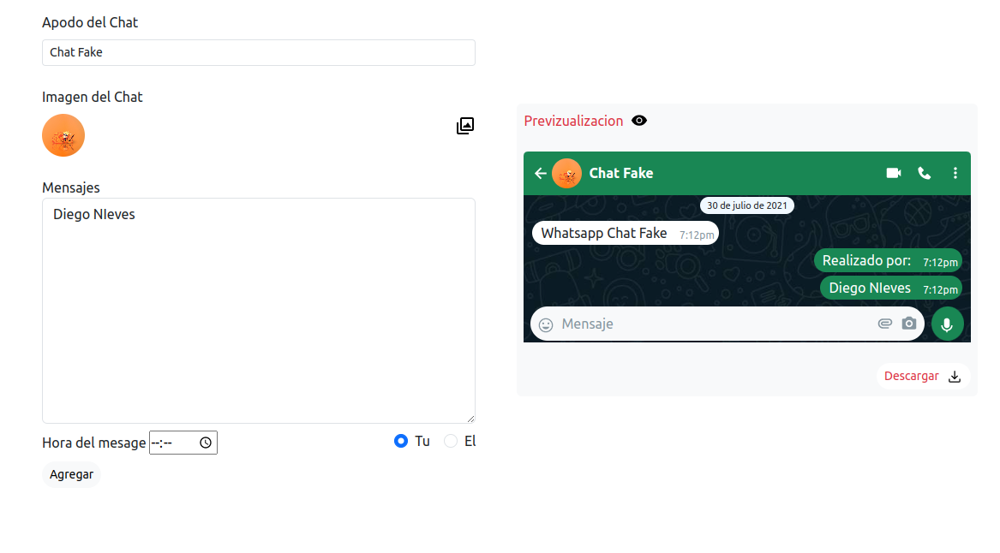

# Whatsapp Chat Fake

    

 

## Decripcion

Realiza un chat falso de Whatsapp agregando los ajustes que el usuario quiera. Se puede descargar el chat generado con la herramienta canvas a travez de una imagen PNG.

## Link

- https://sensational-cupcake-2df5d6.netlify.app/

## Lenguajes o Herramientas

- HTML
- CSS
- JS
- Canvas

## Autor

** Diego Nieves **

- [LinkedIn](https://www.linkedin.com/in/diego-nieves-04b409242/)
- [Portafolio web](https://nvs-portfolio.netlify.app)

## Contactame

Si quieres contactarme puedes escribirme a nieves.diego0426@gmail.com 👍.

  

    

